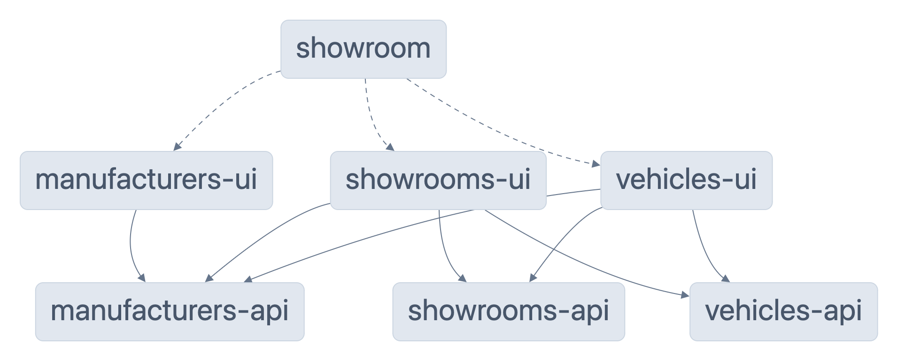

# NgRx

## Table of Contents

- [Why NgRx](#why-ngrx)
  - [NgRx ♥ RxJS](#ngrx--rxjs)
- [NgRx Store](#ngrx-store)
  - [NgRx State Management Lifecycle](#ngrx-state-management-lifecycle)
  - [Entity Adapter](#entity-adapter)
- [Store Combination](#store-combination)
  - [Module Architecture](#module-architecture)

## Why NgRx?

As with all aspects in software development, as applications increase in features more patterns and concepts are realised in order to maintain stability, limit complexity and maximise reuse. Historically, consuming data has been a relatively straight-forward process of HTTP requests and displaying response data, but as front-end technologies have evolved and consumer devices have become more capable, we are doing more and more with data on the client-side and state management has become a necessity for most modern applications, especially single page applications or progressive web apps where there is arguably less reliance on server-side processes.

### NgRx ♥ RxJS

RxJS has been a fundamental technology to many aspects of Angular since its conception. NgRx utilises RxJS to deliver a uni-directional and immutable state data stream. This makes adoption relatively easy for Angular developers, with the main barriers to entry being the learning curve of the general concept and patterns that data stores introduce.

## NgRx Store

There are 4 main components of an NgRx store:

1. **Actions**: Actions are the only way in to a store, they can carry properties and are dispatched from components to trigger effects and updates to the state.
2. **Effects**: Effects are functions that trigger as a side-effect of an action being dispatched. The most common use-case is to call an asynchronous function, such as fetching data from an API, once the API call completes, the effect would result in either a success or failure action being called to update the state accordingly.
3. **Reducer**: The reducer is the only point at which the state can be modified. Functions are created to listen for a specific action and return the new state.
4. **Selectors**: Selectors are used to get data out of the store. They are memoised functions that can return specific properties of a state and manipulate or format data.

#### Facade

A facade can be added to provide convenient access to actions, selectors, the dispatch method and any other store functionality you wish to expose - a facade is the application's window to the store and when properly implemented should be the only import necessary to utilise the store.

### NgRx State Management Lifecycle


### Entity Adapter

## Store Combination

Many use-cases require interacting with multiple stores.

### Module Architecture

When combining stores the architecture of modules needs to be carefully considered to avoid circular dependencies and subsequent restructuring as the app evolves.

Given the example of the Showroom app, there are multiple modules which combine feature store selectors for specific UI implementations. The module dependency graph of the Showroom app below illustrates how UI modules depend on multiple API modules in order to gather data from relevant resources.



Focusing on the Vehicles UI module…


…we can see that vehicles are comprised of manufacturer, showroom, and vehicle data, for example, a Vehicle entity has a manufacturer ID but no direct reference to the name of the manufacturer. To achieve this, selectors from each API module are combined to create a new selector in the UI module.

```typescript
export const selectAllVehicleDetails = createSelector(selectAllVehicles, selectManufacturersEntities, selectShowroomsEntities, (vehicles, manufacturers, showrooms): VehicleDetail[] =>
  vehicles.map((vehicle) => ({
    manufacturer: manufacturers[vehicle.manufacturerId],
    showroom: vehicle.showroomId ? showrooms[vehicle.showroomId] : undefined,
    vehicle,
  }))
);
```

_[libs/vehicles/ui/src/lib/+state/vehicles-ui.selectors.ts](../libs/vehicles/ui/src/lib/+state/vehicles-ui.selectors.ts)_

When considering the use-case of combining manufacturer, showroom and vehicle data to construct the data required to display a vehicle, it might initially make sense to import the Manufacturers API and Showrooms API modules in the Vehicles API module, but this quickly falls apart when one of the dependencies also depends on vehicle data - at this point a circular dependency is formed and our app breaks. This is why we need to lift the combination layer to another module. The separation of API and UI is viable in most cases and is a clear separation of concerns for developers to recognise and maintain.
